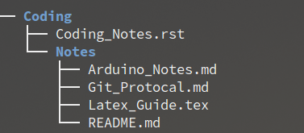
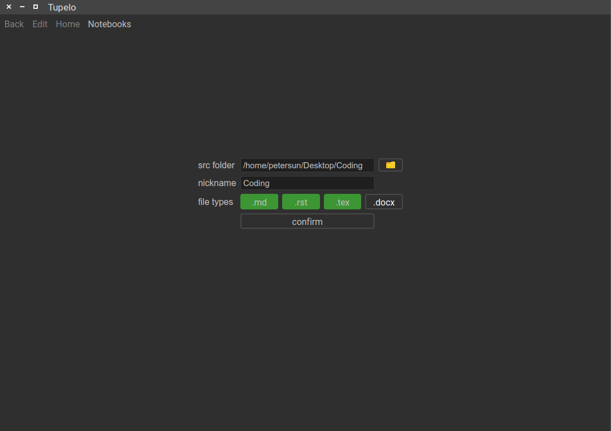
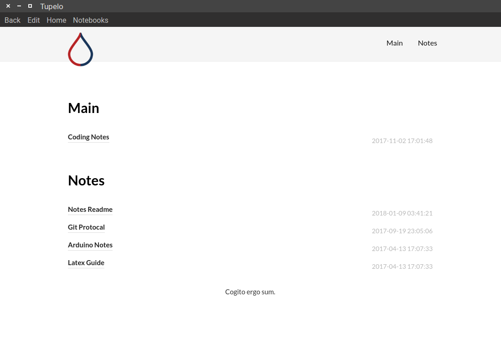
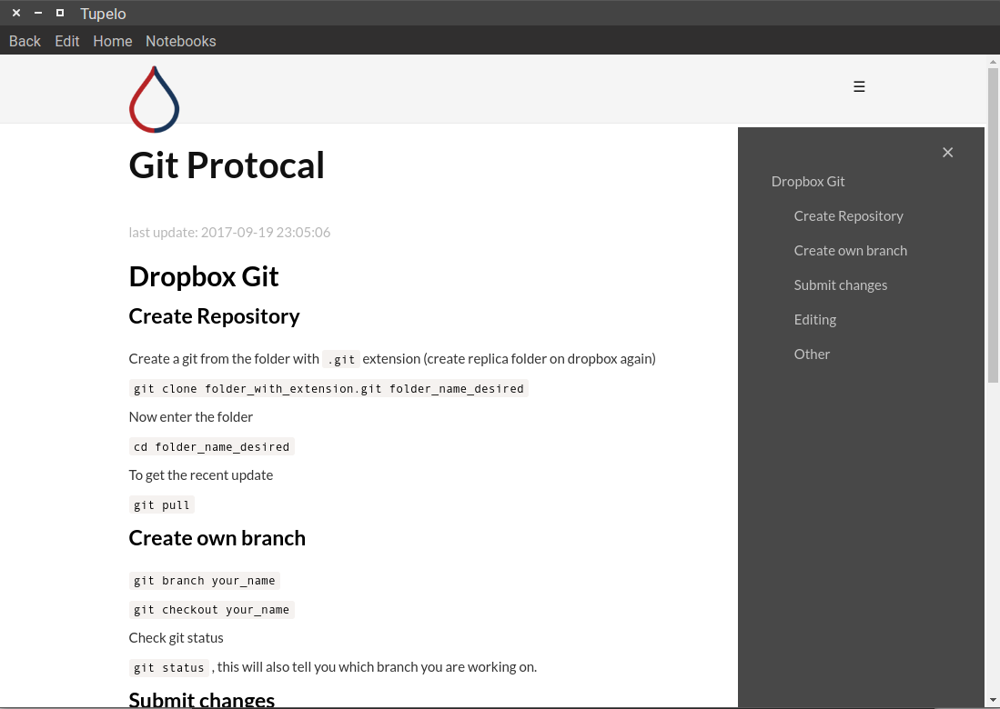

#  Tupelo Notebook 

This notebook is designed for ppl who documents often and uses variety source of note format that are not all supported by current fancy note taking softwares, i.e. markdown, latex, rst. or word documents. The tupelo is designed to create a fast and more readable index of the existing folders of documents.  I am working hard (wink) to create a search engine along side the index ability.

## How to Use

To setup a new notebook, open menu: `notebook > new notebook`, the src folder should be the notebook that contains notes like the following:  
  

The setup page should look like this:  
  
The avaliable format current works with markdown files (`.md`), reStructuredText (`.rst`), latex (`.tex`, in beta), Word (`.docx`, in beta). Recommand to select all (default setting).

And the resulting index page:
  
To ensure simplicity of the index page, only ordered in terms of the first level folder. All `README` files will be renamed by adding the name of the directory name. All `_` will be replaced by space for names and automatically captilized.

The notebook should be rendered using pandoc protocal, and it comes with a table of content located at sidebar.
  
Tupelo comes with live edit, simply click on the edit button when navigated to individual page, and it will automatically update page upon save. All external links are clickable and opened with defualt broswer app to ensure security.

## Requirements

To run the application, the following packages are required:

- Main
    - [`pandoc`](https://pandoc.org/) for render all files to html for display
        - See [installation](https://pandoc.org/installing.html) page for different platforms.
    - Only supports python3

- Python packages (use `python3 -m pip install -r requirements.txt` to install all)
    - [`pypandoc`](https://pypi.python.org/pypi/pypandoc), a thin wrap of pandoc commands. (`pandoc` still required)
    - [`PyQt5.9`](http://pyqt.sourceforge.net/Docs/PyQt5/introduction.html)
    - [`watchdog`](https://pypi.python.org/pypi/watchdog), for live editing
    - [`jinja2`](http://jinja.pocoo.org/docs/2.10/), for generating templates

To build the application using `cx_freeze` (works on all platforms):

- First install `cx_freeze` with `pip`
- Run `python3 setup.py build` at the `docs` directory

Note: If only pytho3 installed on the computer, replace all `python3` above with `python`. 

## Changelog

### Beta 0.1
- Supports all platforms

## What's coming
- Search function
- Multi-user functionalities