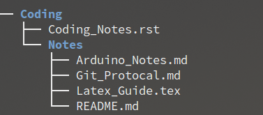
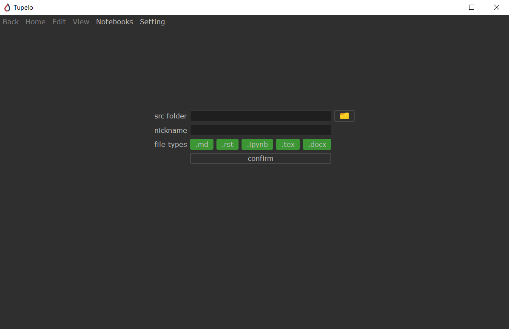
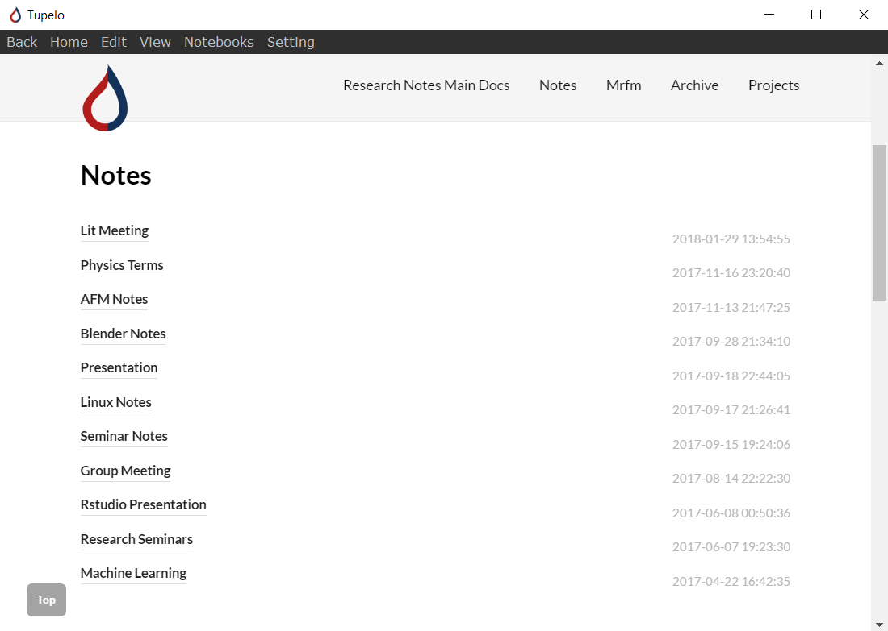
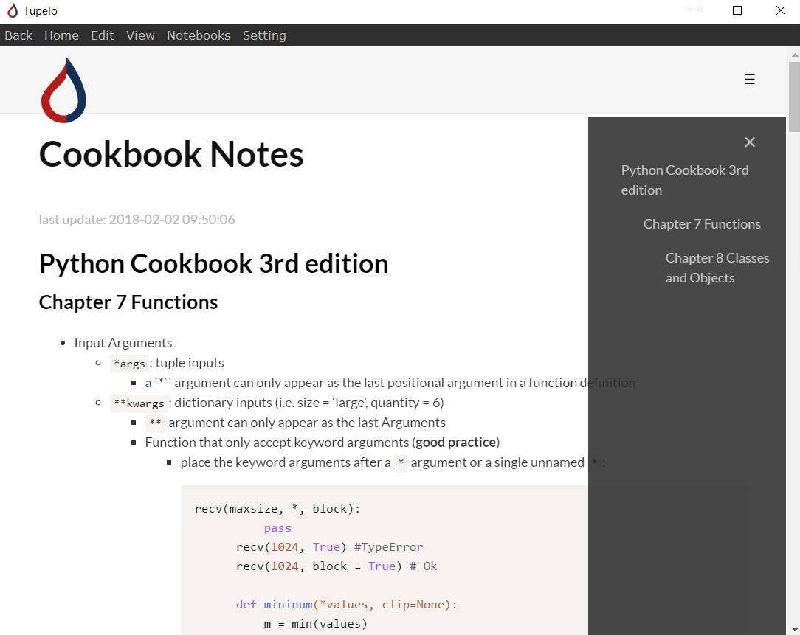

#  Tupelo Notebook 

This notebook is designed for people who documents often and uses variety source of note format that are not all supported by current fancy note taking softwares, i.e. markdown, ipython notebook, reStructuredText, latex, or word documents. The tupelo is designed to create a fast and more readable index of the existing folders of documents.

## How to Use

To setup a new notebook, open menu: `notebook > new notebook`, the src folder should be the notebook that contains notes like the following:  
  

The setup page should look like this:  
  
The available format current works with markdown files (`.md`), reStructuredText (`.rst`), ipython notebooks (`.ipython`), latex (`.tex`, in beta), Word (`.docx`, in beta).

And the resulting index page:
  
To ensure simplicity of the index page, only ordered in terms of the first level folder. All `README` files will be renamed by adding the name of the directory name. All `_` will be replaced by space for names and automatically capitalized.

The notebook should be rendered using pandoc protocol, and it comes with a table of content located at sidebar.
  
Tupelo supports real time editing, simply click on the edit button when navigated to individual page, and it will automatically update page upon save. All external links are click-able and opened with default browser application to ensure security.

## Requirements

### Installer

The windows installer is pre-build, under the `releases` section of github, due to an issue of the compiler, please create your own Desktop/Start Menu stortcuts. Please install `pandoc` first: [pandoc installation](https://pandoc.org/installing.html)

### Compile

To run the application, the following packages are required:

- Main
    - [`pandoc`](https://pandoc.org/) for render all files to html for display
        - See [installation](https://pandoc.org/installing.html) page for different platforms.
    - Only supports python 3.6+

- Python packages (use `python -m pip install -r requirements.txt` to install all)
    - [`PyQt5.9`](http://pyqt.sourceforge.net/Docs/PyQt5/introduction.html)
    - [`watchdog`](https://pypi.python.org/pypi/watchdog), for live editing
    - [`jinja2`](http://jinja.pocoo.org/docs/2.10/), for generating templates
    - [`jupyter`](https://jupyter.readthedocs.io/en/latest/install.html), for ipython notebook rendering option

To build the application using `cx_freeze` (works on both mac and pc):

- First install `cx_freeze` with `pip`
- Run `python3 setup.py build` at the `docs` directory

Note: If only pytho3 installed on the computer, replace all `python3` above with `python`. 

## Change log

- **Beta 0.3.0**.20180208
    - Added ipython notebook file type option
    - Settings and new notebook windows now can be dynamically stretched
    - Added splash screen.
    - Replaced pypandoc with pandoc for better version control

- **Beta 0.2.0**.20180129
    - 'Main' tag changed to 'dst_folder_name Main Doc'
    - Added checking stage for pandoc
    - Fixed Windows 10 unable to display image problem
    - Added zoom and content scaling option
    - Fixed warning text location for notebook setup
    - Added notebook setting page for view settings and notebook settings
    - Supports High DPI displays

- **Beta 0.1.1**.20180113
    - Changed titlize function for better filename to title convertion

- **Beta 0.1.0**.20180105
    - First beta version

## What's coming
- Light/Dark Notebook Theme
- Presentation Mode
- Search functionality
- Multi-user functionalities
